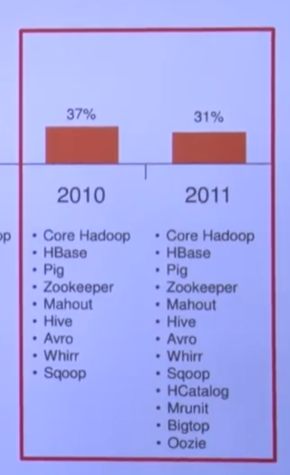
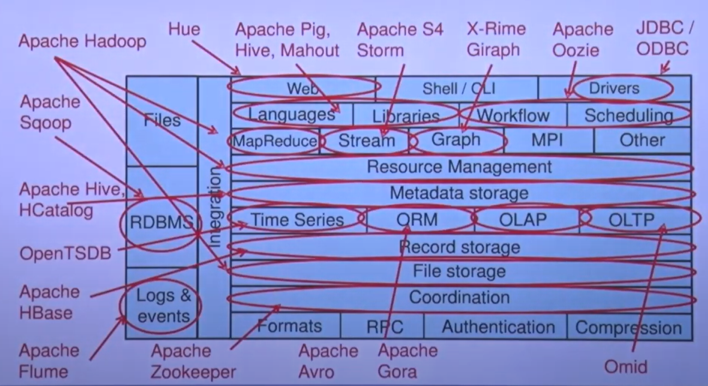
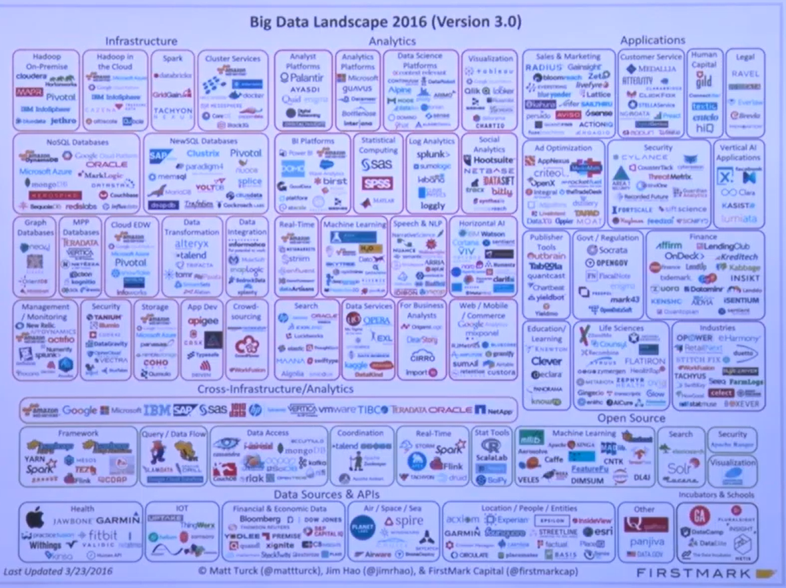
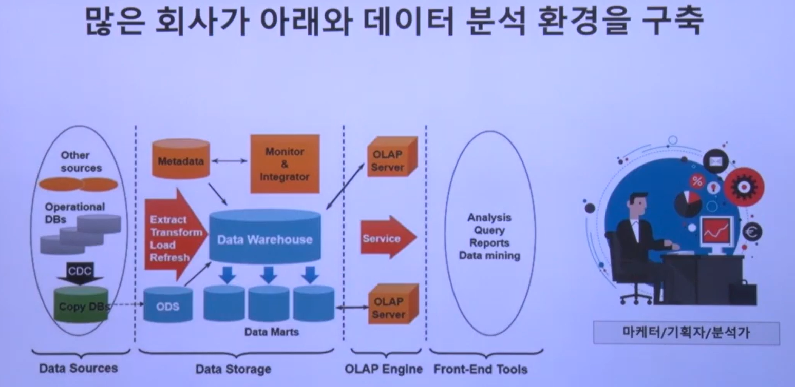
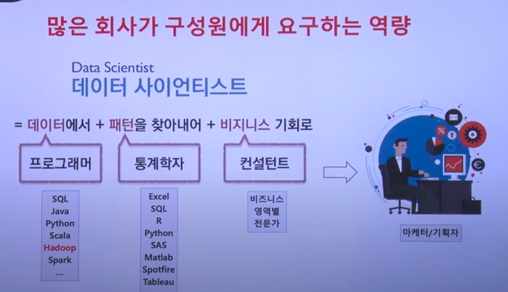
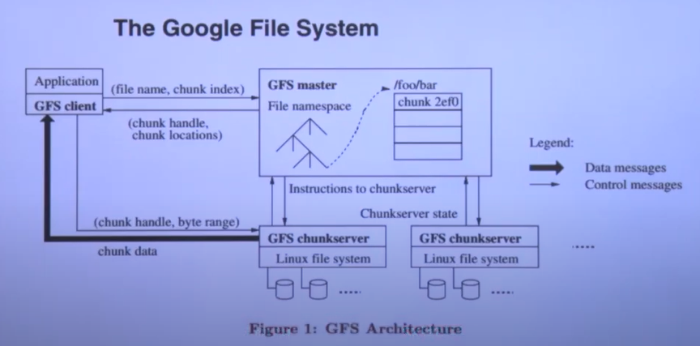
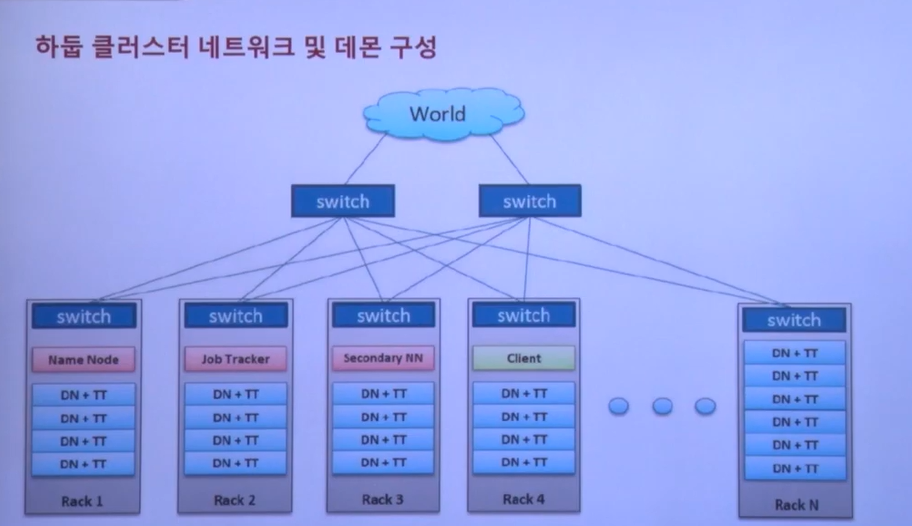
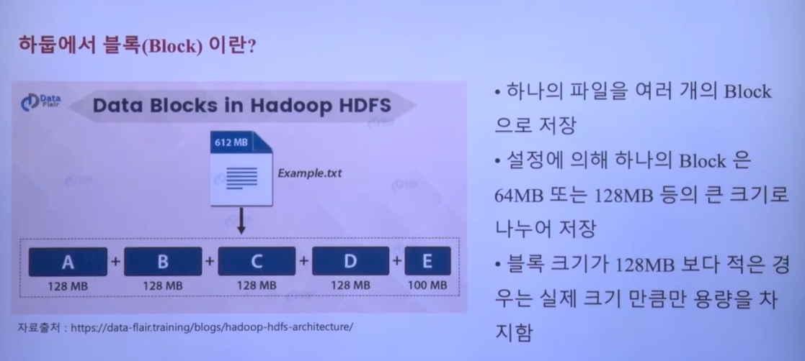
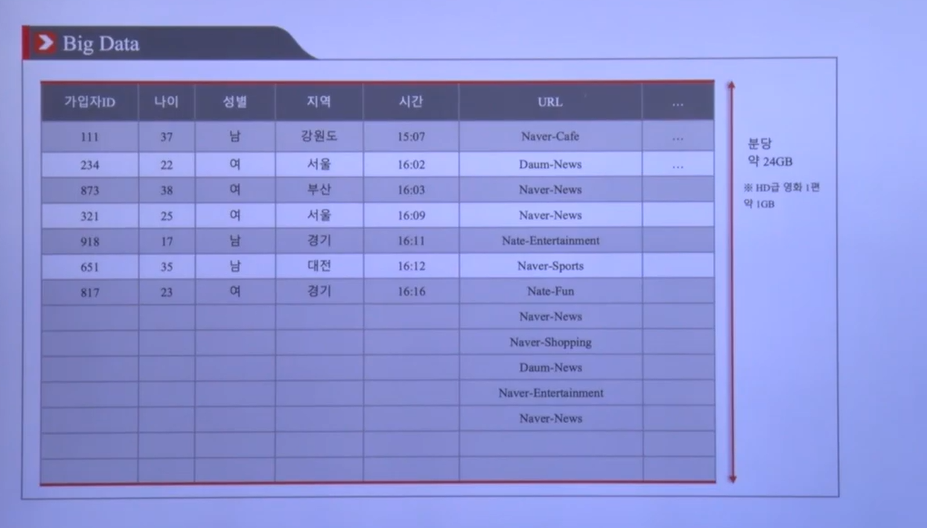
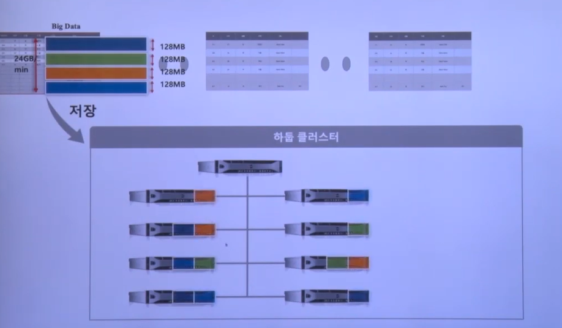

# 참고 문헌
[토크ON 83차. 아파치 하둡 입문 | T아카데미
](https://www.youtube.com/playlist?list=PL9mhQYIlKEheGLT1V_PEby_I9pOXr1o3r)
# 하둡의 탄생과 생태계의 활용
## 하둡을 배워야 하는 이유
* 데이터 홍수의 시대   
  * 우리는 데이터 홍수의 시대에 살고 있으며, 하둡은 비정형 데이터를 포함한 빅데이터를 다루기 위한 가장 적절한 플랫폼
* 글로벌 하둡 마켓의 시장
  * 빅데이터란 용어가 당연해져서 오히려 사용하지 않는 분위기
* 하둡 엔지니어의 수요 증가
  * 데이터 증가로 하둡을 적용하는 회사들은 급증하고 있음
  * 하둡 전문가는 항상 부족함
  * 하둡은 2007년 첫 탄생 이후 3점대 버전까지 나온 굉장한 성숙한 기술
  * 하둡 에코 시스템은 Governace, Finance, Banking, Insurance, Heathcare 등 사회 전반에 걸친 모든 요소드로가 밀접하게 연관되어 사용되고 있음
  * 기존에는 많은 데이터를 사용하는 대기업 위주였지만 지금은 스타트업 뿐만 아니라 전반적으로 수요가 증가함

하둡은 2007년에 첫 탄생, 지금은 3점대 기술 까지 나온 성숙한 플랫폼   
하둡은 소프트웨어 플랫폼, 테크니컬 아키텍트(TA) 인프라쪽 환경에 대해서도 어느정도 알아야 활용할 수 있다.   
소프트웨어와 하드웨어, 인프라를 나눴지만 하둡이 나오고 경계가 무너짐   
소프트웨어 플랫펌 SA도 TA를 잘 알아야 잘 이용할 수 있다.  

## 하둡이란
더그 커팅이 Lucene(인덱싱 라이브러리, 검색엔진에 들어가는 색인기)이라는 Apache 오픈소스로 공개를 시작함   
Lucene 기반으로 Nutch를 추가적으로 탄생
2000년대 초반에 구글이 야후를 제치고 1위할 시점   
구글과 검색엔진을 오픈소스로 만들어 보겠다.   
Hadoop으로 새로 나옴   

Lucene -> Nutch -> Hadoop   

## 하둡 역사
2002 웹을 크롤링 해야하고 무수히 많은 데이터를 수집 및 인덱싱 할려고 하면 굉장히 큰 데이터를 **분산 및 병렬** 처리 해야한다.
이 부분을 Nutch 프로젝트를 하면서 어떻게 해결할 수 있을까 고민하다가
2003 GFS(google file system)이라는 논문을 발표함   
2004 구글에서 Map Reduce에 대해 발표함 구글에서 큰 데이터를 **병렬 분산 처리**하기 위한 알고리즘만 공개, 소스는 공개하지 않음   
2004 해당 논문을 보고  Nutch 파일 분산 시스템 개발 시작함   
2006에 Nutch로부터 Hadoop이 파생됨 야후가 지원함   
2008년에 Apache 프로그램, 슈퍼 컴퓨터의 신기록을 꺠기도 함   

맵 리듀스를 만든 제프 딘(구글), 현재는 인고지능을 총괄함고 있음   
Google File System -> Hadoop Distributed File System **분산**   
Google MapReduce -> Hadoop MapReduce **병렬**   
Google Bigtable -> HBase(NoSQL)   
Google Sawzall -> Hive, Pig   
Google Chubby -> ZooKeeper   

구글 논문이 Apache 프로젝트로 일대일 대응 하듯이 생겨남

RDB는 보통 데이터를 공유스토리지(SAM NAS) 같은걸 사용함
데이타의 저장량이 늘어나고 컴퓨팅 리소스가 늘어나면 어느정도 증가하다가 DISK IO에 바틀넥이 걸리면서 성능이 떨어지는 변곡점이 존재함
-> 이를 해결하기 위해서 분산 데이터 베이스가 많이 등장함   
HBase : 분산 데이터 베이스

하둡은 기본적으로 Java로 개발되어 있음
플래폼은 자바지만 다른 걸로도 개발할 수 있음
조금 더 편하게 쓰기 위해서 스크립트 언어로 사용하는데 SawZall
Pig 아파치 프로젝트는 분산 파일 시스템에 저장된 데이터를  MapReduce 어플리케이션을 개발해서 처리할 수도 있지만 대신 Pig 스크립트 신텍스를 사용해서 처리할 수 있음

데이터를 가장 많이 다루는 SQL 
하둡 분산 데이터는 SQL로는 다룰 수는 없냐 해서 Hive라는 프로젝트 시작함
SQL과 유사한 랭귀지 지원 지금은 SQL같은 언어를 작성해서 핸들링하는것이 일반적임
SQL로 하기 위해선 정형화된 데이터이어야 한다.
비정형, 반정형의 경우 SQL로 처리하기 쉽지 않아서 MapReduce로 처리해야핳ㄴ다.

   
저장된 데이터를 어떻게 다룰 것이냐

* Hbase 분산 데이터, 카산드라, mongo db
* ZooKeeper 분산 환경의 데이터를 다루면 코디네이터 역활이 필요한 경우 사용함
* Mahout : SQL은 큰 데이터를 직접 구현하는 연산을 진행하는데 좀 더 복잡함 데이터를 처리하기 위해서는 구현체가 필요하다. 조금 더 복잡한 ML, 인공지능과 같은 큰 흐름의 데이터를 처리하기 위해서는 또 별도의 알고리즘이 필요하다, 하둡같은 분산 플랫폼에 저장되어 있는 데이터에서 처리할 수 있도록 구현되어 있는 아웃풋 절차??
* Hive SQL로 하둡에 있는 데이터를 다루는 부분
* Avro: 경량 어플리케이션 서버 (생략)
* Sqoop 은 하둡이 굉장히 큰 데이터를 다루는 플랫폼이지만 관계형 데이터는 기업내에서 많이 사용된다. 서로 관계형 데이터 DB와 Hdoop이 데이터를 주고받아야 하는 경우 사용하는 프레임 워크
* HCatalog : 사용자가 개발자는 가지가 편한 걸 사용한다.   
하둡에 저장된 기본적으로 저장된 데이터를 하나의 카탈로그 서시스로 다룬다??
* Oozie, airflow : 하둡에 큰 데이터를 저장하고 ETL, 데이터 처리를 많이 하는데 하둡에 데이터가 저장되면 데이터 마트로 새로 만들거나 분석된 결과를 데이터로 저장하는데 이를 배치로 많이 한다. 최종 마트를 만들기 전에 여러 워크플로우를 거쳐야 하는데, 최종적인 Oupt을 만들기 위해서 여러 잡이 돌거나 합쳐저서 돌아야 하는 경우가 있는데 이러한 워크를 스케쥴링 해주는 플랫폼

   
하둡 에코 시스템이 지속적으로 성자앟고 있다.

   
하둡을 중심으로 한 솔루션들이 존재한다.

## Big Data라는 용어를 누가 탄생 시켰나?
성숙한 단계에 다다른 용어
초창기 **Big** Data = Hadoop 하둡 짱 좋음   
지금 Big **Data**  하둡 덕분에 더이상 많은 데이터를 저장하기 위해 큰 비용이 들지 않는다.   
=> 고가의 Storage를 많이 살 필요가 없다.   

저장을 하고 분석을 하려고 하는데 요즘은 데이터에 더 초점이 맞춰져 있고 더 많은 이윤을 남기기 위해서 노력중이다.   
컴퓨터, 통신 작고 싸진다.   

오프라인 -> 온라인 (모든 것이 데이터로 남는다.)   
 IoT 핵심 센서

Hadoop리하는 기술을 바탕으로 가격이 줄어들고 DAta로 다양하 ㄴ기회를 만들수 있다. -> 인공지능   
더이상 사람이 눈으로 분석할 수 있는 수준이 아니기 떄문에  AI로 사람 이상의 분석을 시키고자 한다.   

   
* 데이터를 웨어하우스, 레이크라는 이름으로 모으는 작업을 진행함   
* 마케팅 쪽에서 발생하는 데이터를 하기 위해 1차적으로 데이터를 통합 저장소에 저장을 함
* 저장한 데이터를 그대로 두지 않고 현업 전문가의 의견을 받아서 유의미한 데이터를 만든다 -> 데이터 마트
* 현업 분석가의 분석을 통해 니즈를 만들고 여러가지 인사이트를 만들고 도출한다.
* SKT도 많은 회사들이 이런 형태로 분석환경을 구축해서 사용함
* 분석가만 분석하는게 아닌 여러 구성원이 분석할 수 있도록 공개하는 상황
* 중간의 시스템을 Hadoop을 이용해서 직접 시스템을 구축한다.
* 전반적인 데이터 처리 업무를 직접 개발 및 운영하는ㄴ 경우가 많다.
* 분석은 아직 사용 솔루션 최근 주피터나 제플린같은 오픈소스 많이 사용함
* 요새는 거의 모든 구성원이 Python SQL등을 활용해서 결과를 도출함
* 이런것을 필요한 역량으로 정의함

* 데이터에서 + 패턴을 찾아내어 + 비지니스 기회로
* 

# 하둡 설치
* Java 1.8 이상
* Hadoop 3.3.0 hadoop-3.3.0.tar.gz
* Hive 3.1.2
* Intellij 맵 리듀스 직접 개발 (Maven 사용)

/home/Platform
tar xvfz hadoop-3.3.0.tar.gz
tar xcfz apache-hive-3.1.2-bin.tar.gz

core-site.xml 하둡 코어 설정 값   
hdfs-site.xml 하둡 분산처리 시스템 설정 값   
yarn-site.xml 맵리듀스(맵리듀스 자체는 아님)쪽 설정   

기본적으로 파일을 복제할 때 원본 포함해서 3개를 복제함   
지금은 replication 1개만 설정함

실행전에 namenode를 한 번 포맷함

cp 복사할 대상 경로+파일  복사할 위치의 경로 + 파일

# 3강 - 하둡 분산파일시스템 이해(1)

GFS 아키텍쳐
분산환경에서 동작하는 분산 플랫폼들
물리적으로 여러대의 서버가 하나의 클래스터처럼 동작하는 플랫폼처럼 동작하는 것   
마스터 슬레이브와 No 마스터 구조 2가지가 있음   
* 마스터 슬레이브와 : 마스터 데몬이 있고 마스터의 관리를 받는 슬레이브 서버가 있음 (대부분의 구조 , GFS도 마찬가지)   
* No 마스터 구조 : 마스터가 가지고 있어야 하는 정보를 모든 노드가 가지고 있는다.   

GFS 는 마스터 -슬레이브 구조다.
chunk server가 계속 확장되는 구조

마스터 슬레이브 구조에서 마스터에 부하가 가지 않는 상황을 항상 만들어야 한다.   
* chunk 서버와 client가 서로 connection해서 주고 받지만 마스터에서는 직접적으로 파일을 주고 받지 않는다.
* 왜냐하면 마스터 쪽에 장애가 나면 전체 클러스터가 제대로 동작하지 않는다. 즉 마스터가 안정적인 상황이 유지되어야 한다.

구글 플랫폼의 철학
* 한대의 고가 장비고다 여러 대의 저가 장비가 낫다. 스케일 아웃(여러대 추가) <-> 스케일 업(단일 성능 성장)   
* 데이터는 분산 저장하낟.
* 시스템(H/W)은 언제든 죽을 수 있다. (Smart S/W)
* 시스템 확장이 쉬워야 한다. (장비를 더 추가만 해서 클러스터 노드 수를 늘리면 잘 동작해야한다.)

패러럴은 CPU 병렬 처리
디스트리뷰트는 데이터를 분산하는데 큰 의미가 있다.   

잘 연계가 되고 유기적으로 연결되어 있다.   

## 분산 & 자동화

관리자는 하드만 교환하면 정상적으로 동작하도록 하는것이

하둡 특성
* 수천대 이상의 리눅스 기반 범용 서버들을 하나의 클러스터로 사용
* 마스터-슬레이브 구조
* 파일은 블록 단위로 저장
* 블록 데이터의 복제본 유지로 인한 신뢰성 보장 (기본 3개의 복제본)
* 높은 내고장성(Fault-Tolerance)
* 데이터 처리의 지역성 보장

   
하둡은 수백대, 수천대로 운영을 할 때 의미가 있다.
한대 두대는 의미가 없다.

여러대의 서버를 하나의 클리스터로 구성함   
넥형 하나의 렉에 20대 가 들어감???
하둡 1.0 기준임   

네임노드가 마스터 서버 역활을 한다. (하둡 분산파일 시스템의 마스터)   
마스터는 언제나 부하를 최소화 하는 구조여야함   
슬레이브에는 : DN DataNode + TT tasktracker -<- 슬레이브 데몬   
분산 파일 시스템의 어플리케이션 처리를 위해서 Job Tracker라는걸 가지고 있음(전 체 잡 관리함)   
하둡 1.0 데몬의 구성    
마스터의 주요 데몬
* Name Node : 마스터의 DFS를 관리하는
* Job Tracker :ㅣ 잡관리
* Secondary NN
* Client 

## 하둡에서 블록이란?

612MB -> 128MB 여러개로 쪼개서
!!! 하둡이 하나의 큰 파일을 쪼개는 단위를 블록이라고 함
1.0에서는 64MB -> 최근에는 128MB   
100MB가 남는데 100MB로 저장함   
### 블록이 큰 이유
* HDFS의 블록은 128MB(디폴트, 변경 가능)와 같이 매우 큰 단위
* 블록이 큰 이유는 담색 비용을 최소화할 수 있기 때문
* 블록이 크면 하드 디스크에서 블록의 시작점을 탐색하는 데 걸리는 시간을 줄일 수 있고, 네트워크를 통해 데이터를 전송하는데 더 많은 시간을 할당함 (주목적)
* 데이터 처리를 빨리 할 수 있다.

   
1분에 24GB가 생성된다면???   
대부분의 서비스에서는 시간의 흐름에 따라 계속 생성된 time serise
로그성 데이터 들이 우리가 자주 볼 수 있는 데이터 중 하나   
하둡 클러스터에 저장을 했다면 (하둡 커맨드로 저장, kafka와 같은 프로그램과 연계해서 저장하는 방법도 있음)   

해당 파일을 128MB로 나눠서 저장함

마스터에는 저장하지 않고 8대의 슬레이브 서버에 블록 단위로 저장됨

