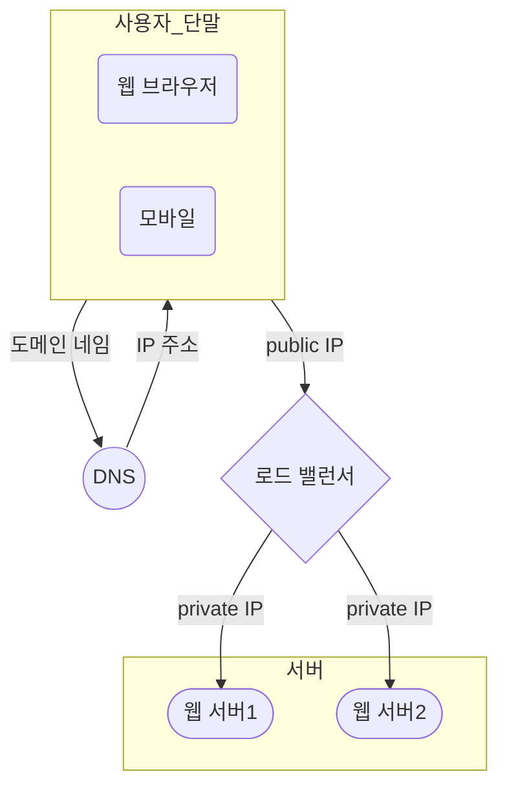

# 서버 구성 단계에 따른 시스템 구성
## 단일 서버
### 단일 서버에서 모든(웹 앱, 데이터베이스, 캐시 등) 기능을 구현한 경우

### 서버를 웹 앱과 DB로 나눈 경우

#### NoSQL이 더 적합한 경우
* 아주 낮은 응답 지연시간(latency)이 요구되는 경우
* 다루는 데이터가 비정형(unstructured)이라 관계형 데이터가 아닌 경우
* 데이터(JSON, YAML, XML 등)를 직렬화(serialize), 역직렬화(deserialize)만 필요한 경우
* 아주 많은 데이터를 저장할 경우 (아주 많은의 기준은??)

#### scale up의 단점, scale out으로 확장해야 하는 이유
* scale up
  - 한 대의 서버에 CPU나 메모리르 무한대로 증설할 수 없다.
  - 자동복구(failover) 방안, 다중화(redundancy) 방안을 제시하지 않는다.

### 로드 밸런스를 추가하여 웹 서버의 다운에 대응하는 방법

#### 로드밸런스 사용시 이점
* 웹 서버가 클라이언트의 접속을 직접 처리 하지 않음으로써 보안이 향상됨
* 서버 장애시(failover) 자동복구가 가능함
* 웹 계층의 가용성 향상
* 웹 서버1이 다운(offline)되면 모든 트래픽이 웹 서버2로 전송하여 웹 사이트 전체가 다운되는 일을 예방함
* 웹 사이트로 유입되는 트랙픽이 가파르게 증가하는 경우, 두 대의 서버로 트래픽을 감당할 수 없는 시점이 발생한다면, 서버를 추가하여 트래픽을 감당할 수 있음
  

#### 로드밸런스를 사용시 얻는 이점
* 향상된 성능 : master-slave 모뎅에서는 데이터 변경 연산은 master로만 전달되는 반면, 읽기 연산은 slave 데이터 베이스로 분산가능, 병렬로 처리할 수 있는 query가 증가함으로 성능이 향상됨
* 가용성(availability) : 데이터를 여러 지역에 복제해 둠으로써, 하나의 데이터 베이스 서버에 장애가 발생하더라도 다른 서버에 있는 데이터를 가져와 계속 서비스할 수 있음
* 안정성(reliability) : 자연 재해, 사고 등의 이유로 데이터베이스 일부가 파괴되어도 데이터가 보존될 수 있음

#### DB 다중화시 얻는 이점
* slave DB 다운 시, 여분의 slave DB가 있다면 해당 DB에서 읽기 수행 가능, 여분의 slave DB가 없다면 master DB에서 읽기 수행 가능
* master DB 다운 시, slave DB가 master 역활을 대신 수행할 수 있음

#### 프로덕션 환경에서 고려해야할 점
* master DB가 죽고, slave DB가 master를 대신하는 경우 데이터가 최신 상태가 아닌 경우가 존재할 수 있음
  * 데이터 복구 스트립트(recovery script)를 이용하여 데이터 복구 시도
  * 다중 마스터(multi-master), 원형 다중화(circular replication) 방식이 존재함

### 정리

#### 위의 설계안에서 동작절차
* 사용자는 DNS 서버로부터 로드밸런서의 공개 IP를 받음
* 사용자는 공개 IP를 통해 로드밸런서에 접속
* HTTP 요청을 웹 서버1 혹은 웹 서버2로 전달됨 (경로에 따라?)
* 읽기 연산이 있는 경우 사용자의 데이터를 slave DB에서 데이터 읽음
* 쓰기 연산이 있는 경우 master DB에서 데이터 작성

### 읽기 주도형 캐시 전략
* 서버에서 데이터를 읽기 위해 캐시의 데이터를 조회함
  * 캐시에 데이터가 있다면 바로 읽음
  * 캐시에 데이터가 없다면 slave DB에서 읽어 캐시에 쓰고, 데이터를 읽음

#### 캐시 사용하시 고려할 점
* 캐시는 언제 사용하기 좋은가? 데이터 갱신은 자주 일어나지 않지만 참조는 빈번하게 일어나는 경우 캐시 사용이 적합함
* 캐시의 특성을 고려했는가? 캐시의 데이터는 영속적이지 않음(휘발성), 영속적인 데이터는 지속적 저장소(persistent data store)에 저장
* 데이터 만료 정책은 어떻게 정할 것인가?
  * 너무 짧은 경우 : 데이터 베이스를 너무 자주 읽음
  * 너무 긴 경우 : 데이터 베이스의 내용과 다른 상황이 발생할 수 있음
* 일관성(consistency)유지 방법은? 저장소 원본 갱신 연산과 캐시 갱신 연산이 단일 트랜잭션으로 처리되지 않는 경우 일관성이 깨짐
* 장애 대처 방법, 캐시 서버를 한 대만 두는 경우 해당 서버는 단일 장애 지점(Single Point of Failure, SPOF)이 되어버릴 가능성이 있음
* 캐시 메모리는 얼마나 크게 잡을 것인가? 캐시 메모리가 너무 작은 경우 : 데이터가 너무 자주 캐시에서 밀려나버려(eviction) 캐시의 성능이 떨어짐, 이를 해결하기 위해 캐시 메모리를 과할당(overprovision)함
* 데이터 방출(eviction) 정책은 무엇인가? 캐시의 메모리가 가득 찬 경우 추가로 캐시에 데이터를 넣을때 기존 데이터를 내보내는 정책을 데이터 방출 정책이라하며, 가장 많이 사용되는 정책은 LRU(Least Recently Used)이 있으며, LFU(Least Frequently Used), FIFO(First In First Out)등이 존재함

### CDN
> 요청 경로(requst path), 질의 문자열(query string), 쿠키(cookie), 요청 헤더(request header) 등의 정보에 기반하여 HTML 페이지를 캐시하는 것

#### CDN을 캐시 하는 방법

#### CDN을 사용시 고려할 사항
* CDN 비용은 얼마인가? 보통 CDN은 제 3사업자에 의해 운영됨, CDN으로 들어가고 나가는 데이터의 전송 양에 따라 요금을 냄, 자주 사용되지 않는 컨텐츠는 캐싱시 이득이 크지 않으므로 제외하기
* 적절한 만료 시한은? 시의성이 중요한(time-sensitive) 콘텐츠의 경우 만료 시점을 잘 정해야 함, 너무 긴 경우 컨텐츠의 신선도가 떨어지며, 너무 짧은 경우 원본 서버에 빈번하게 접속함
* CDN 장애 대처 방안은? CDN 자체가 죽은 경우 웹사이트/애플리케이션이 어떻게 동작하는지 고려해야 함, CDN이 죽은 경우 해당 문제를 감지하여 원본 서버로부터 직접 컨텐츠를 가져오도록 클라이언트를 구성해야하는 경우가 존재함
* 컨텐츠 무효화(invalidation) 방법 : 아직 만료되지 않은 컨텐츠라 하더라도 아래 방법 가운데 하나를 사용하면 CDN에서 제거할 수 있음
  * CDN 서비스 사업자가 제공하는 API를 이용하여 컨텐츠 무효화
  * 컨텐츠의 다른 버전을 서비스하도록 오브젝트 버저닝(object versioning)이용, 컨텐츠의 새로운 버전을 지정하기 위해서 URL 마지막에 버전 번호를 인자로 제공함 ex)image.png?v=2

### 캐시, CDN을 추가한 서버

### 무상태(stateless) 웹 계층
> 수평적으로 확장하기 위해서는 상태 정보(사용자 세션 데이터 등)을 웹 계층에서 제거해야 함, 바람직한 전력은 상태 정보를 지속정 저장소(DB)에 저장하고 필요할 때 가져오는 것

#### 상태 정보에 의존적인 아키텍쳐
* 상태 정보를 보관하는 서버는 클라이언트 정보(상태 정보)를 유지하여 요청에 포함되어 있음, 무상태 서버에는 이런 장치가 존재하지 않음
* 상태 정보에 의존적인 경우 서버에 요청을 보낼 때, 반드시 기존의 서버로 보내야 함

#### 무상태 아키텍쳐

* 해당 구조에서는 HTTP 요청은 어떤 서버에서든 처리가 가능함
* 웹 서버는 상태 정보가 필요한 경우 공유 저장소(shared storage)로부터 데이터를 가져옴
* 위의 구조에서 상태 정보는 웹 서버로부터 물리적으로 분리되어 있어 단순하고, 안정적이며, 규모 확장이 용이함
  

* 위의 그림에서 상태를 저장하는 저장소를 NoSQL로 표현하였지만 다른 DB혹은 캐시도 가능함, 다만 규모 확장성 면에서 NoSQL이 좋음
* 서버에 자동 규모 확장이라는 키워드가 붙어 있음, 이는 상태 정보가 서버로부터 분리되어 있으므로, 트래픽 양에 따라 단순 웹 서버의 추가/제거로 규모 확장이 편리해짐을 의미함

### 데이터 센터
> 서비스가 전세계의 주목을 받는 경우 가용성을 높이고 전 세계 어디서도 쾌적하게 사용할 수 있도록 하기 위해서는 여러 데이터 센터(data center)를 지원하는 것이 필수

* 지리적 라우팅(geoDNS-routing) : 장애가 없는 상황에서 사용자는 가장 가까운 데이터 센터로 안내됨, 사용자의 위치에 따라 도메인 이름을 어떤 IP 주소로 변환할 지 결정해 주는 DNS 서비스
* 

#### 위의 구조에서 고려해야 할 기술적 문제
* 트래픽 우회는 어떻게? 올바른 데이터 센터로 트래픽을 보내는 효과적인 방법이 필요함, GeoDNS는 사용자에게 가장 가까운 데이터센터로 트래픽을 보낼 수 있도록 도와줌
* 데이터 동기화(synchronization)는 어떻게? 데이터 센터마다 별도의 데이터베이스를 사용하고 있는 상황에서 장애가 발생하고 복구되어 기존의 데이터베이스로 우회되더라고 데이터가 없는 상황이 발생할 수 있음, 이를 해결하기 위한 보편적인 전략은 데이터를 여러 데이터센터에 걸쳐 다중화 하는 것, [넷플릭스 데이터 다중화 방법]()
* 테스트와 배포(deployment)는 어떻게? 여러 데이터 센터를 사용하도록 시스템이 구성된 상황이라면 웹 사이트 또는 애플리케이션을 여러 위치에 테스트해보는 것이 주용하다. 한편 자동화된 배포 도구는 모든 데이터 센터에 동일한 서비스가 설치되도록 하는 데 중요한 역활을 한다.

## 메세지 큐를 활용한 시스템 컴포넌트 분리
> 메시지 큐는 메시지의 무손실(durability, 즉 메시지 큐에 일단 보관된 메세지는 소비자가 꺼낼 떄까지 안전히 보관된다는 특성)을 보장하는 비동기 통신을 지원하는 컴포넌트, 메시지의 버퍼 역활을 하며 비동기적으로 전송한다.

#### 메시지 큐의 구조

#### 메시지 큐 사용시 이점
* 서비스간 또는 서버 간 결합이 느근해짐
* 규모 확장성이 보장되어야 하는 안정적 애플리케이션 구현이 용이함
* 생산자는 소비자 프로세스가 다운되어 있어도 메시지를 발행할 수 있고, 소비자는 생산자 서비스가 가용한 상태가 아니더라도 메시지를 수신할 수 있음

## 로그, 메트릭 그리고 자동화
* 로그 : 에러 로그를 모니터링 하는것은 중요함, 시스템의 오류와 문제들을 쉽게 찾아낼 수 있음, 로그를 단일 서비스로 모아주는 도구를 활용하면더 편리하게 검색하고 조회가 가능함
* 메트릭 : 메트리긍ㄹ 잘 수집하면 사업 현황에 관한 유용한 정보를 얻을 수도 있고, 시스템의 현재 상태를 손쉽게 파악할 수도 있음
  * 호스트 단위 메트릭 : CPU, 메모리, 디스크 I/O에 관란 메트릭이 여기 해당
  * 종합(aggregated) 메트릭 : 데이터베이스 게층의 성능, 캐시 계층의 성능 같은 것
  * 핵심 비지니스 메트릭 : 일별 능동 사용자(daily active user), 수익(revenud), 재방문(retention) 같은 것이 여기 해당
* 자동화 : 시스템이 크고 복잡해지면 생산성을 높이기 위해서 자동화 도구를 활용해야 함, 가령 지속적 통합을 도와주는 도구를 활용하면 개발자가 만드는 코드가 어떤 검증 절차를 자동으로 거치도록 할 수 있어서 문제를 쉽게 감지할 수 있음, 이 외에도 빌드, 테스트, 배포 등의 절차를 자동화할 수 있어서 개발 생산성을 크게 향상시킬 수 있음
  

## 데이터베이스 규모 확장
> 저장할 데이터가 많아지면 데이터베이스에 대한 부하도 증가한다.
> 그때가 오면 데이터베이스를 증설할 방법을 찾아야 한다.
#### 데이터 베이스 확장 방법
* 수직적 규모 확장법
  * 기존 서버에 더 많은 고성능 자원(CPU, RAM, 디스크 등)을 증설하는 방법
  * 데이터베이스 서버 하드웨어는 한계가 있으므로 CPU, RAM 등을 무산 증설할 수는 없다.
  * SPOF(Single Point of Failure)로 인한 위험성이 크다.
  * 비용이 많이 든다.
* 수평적 규모 확장법
  * 샤딩(sharding)이라고도 부르는데, 더 많은 서버를 추가함으로써 성능을 향상시킬 수 있음
  * 샤딩은 대규모 데이터베이스를 샤드(shard)라고 부르는 작은 단위로 분할하는 기술을 일컫는다. 모든 샤드는 같은 스키마를 쓰지만 샤드에 보관되는 데이터 사이에는 중복이 없다.

#### 샤딩 전략구현 시 고려해야할 사항
* 샤딩 키(sharding key | partion key)를 어떻게 정할 것인가? 데이터가 어떻게 분산될 지 정하는 기준으로 하나 이상의 칼럼으로 구성되어 있다., 이때, 샤딩키는 데이터 베이스에 고르게 분할 할 수 있도록 하는 것이 중요하다
* 데이터의 재 샤딩을 고려해야 하는 상황은? : 데이터가 너무 많아지거나 하나의 샤드로는 더 이상 감당이 어려운 경우, 샤드간 데이터 분포가 균등하지 못하여 어떤 샤드에 할당된 공간 소모가 다른 샤드에 비해 빨리 진행되는 경우 -> 샤드 키를 계산하는 함수를 변경하고 데이터를 재 배치해야한다. [안정 해시]()를 활용하면 해결 가능하다
* 유명인사(celebrity)가 존재하는 경우 어떻게 할 것인가? 핫스팟 키(hotspot key)문제라고도 부르는데, 특정 샤드에 질의가 집중되어 서버에 과부하가 걸리는 문제, 특정 샤드에 자주 조회하는 데이터가 있는 경우  read연산 때문에 과부하가 걸릴 수 있음 -> 유명인사를 각각 샤드에 할당하거나 더 잘게 쪼개야 한다.
* 조인과 비정규화(join and de-normalization): 일단 하나의 데이터 베이스를 여러 샤드 서버로 쪼개고 나면, 여러 샤드에 걸친 데이터를 조인하기가 힘들어진다. 이를 해결하기 할 수 있는 한가지 방법은 데이터베이스를 비정규화하여 하나의 데이블에서 질의가 수행될 수 있도록 하는 것이다.

## 백만 사용자, 그리고 그 이상
> 시스템 규모 확장은 지속적이고 반복적이다. 이번 장에서 다룬 내용을 반복하다보면 워하는 규모의 시스템으 ㄹ달성할 수 있다. 그러나 수백만 사용자 이상을 지원하려면 새로운 전략을 도입해야 하고, 지속적으로 시스템을 가다듬어야 할 것이다.

## 이번장에서 다룬 기술
* 웹 계층은 무상태 계층으로
* 모든 계층에 다중화 도입
* 가능한 한 많은 데이터를 캐시할 것
* 여러 데이터 센터를 지원할 것
* 정적 컨텐츠는 CDN을 통해 서비스 할 것
* 데이터 계층은 샤딩을 통해 그 규모를 확장할 것
* 각 계층은 독립적 서비스로 분할할 것
* 시스템을 지속적으로 모니터링하고, 자동화 도구들을 활용할 것
  