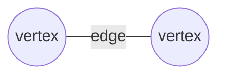
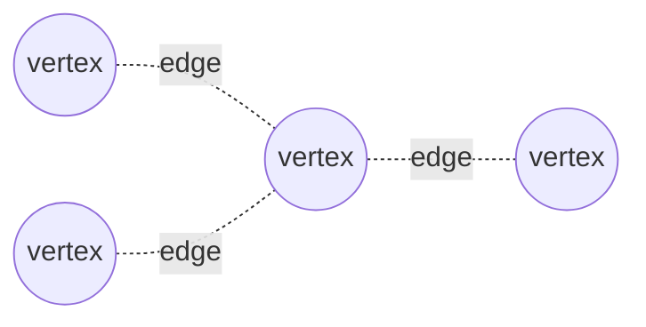
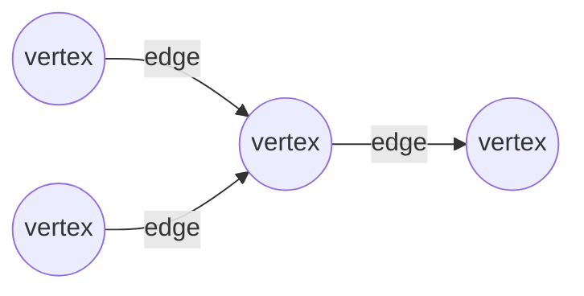
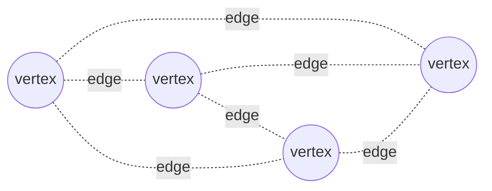
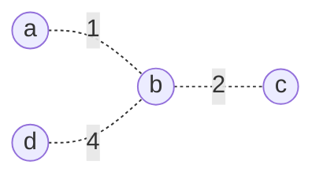
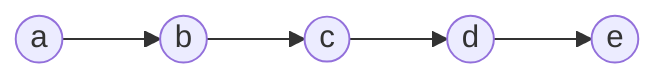
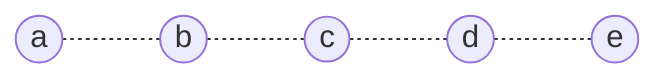
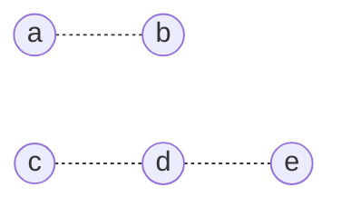
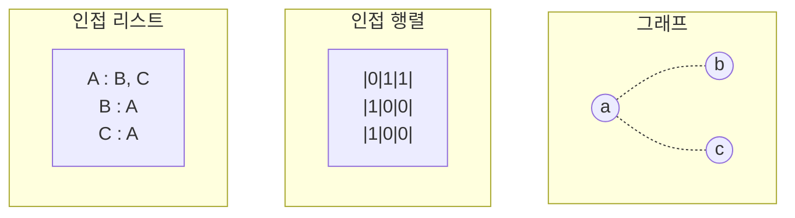

# 그래프

## 그래프를 이루고 있는 요소?
* 정점(vertex, node) : 그래프 집합에 포함되어 있는 요소들을 의미합니다.
* 간선(edge) : 집합에 포함되어 있는 요소들의 관계를 의미합니다.

## 그래프 관련 용어
* 차수(degree) : 무방향 그래프에서 하나의 정점과 인접한 정점의 수
* 진입 차수(in-degree, 내차수) : 방향 그래프에서 외부에서 들어오는 방향의 간선의 수
* 진출 차수(out-degree, 내차수) : 방향 그래프에서 외부로 나가는 방향 간선의 수
* 단순 경로 : 반복되는 정점 없이 연결된 경로
* 사이클 : 단순 경로에서 시작 정점과 마지막 정점이 같은 경우
   

## 그래프 종류
### 간선의 종류에 따른 그래프
#### 무방향 그래프
* 정점간에 관계를 나타내는 간선에 방향이 존재하지 않습니다.(= 양방향)
* 간선은 굵은 실선 혹은 점선으로 표기합니다.

#### 방향 그래프
* 간선에 방향이 존재합니다.
* 간선을 표시할 때 화살표로 표시합니다.

### 정점의 관계에 따른 그래프
#### 완전 그래프
* 모든 정점이 본인을 제외한 다른 정점과 연결되어 있습니다.

#### 부분 그래프
* 완전 그래프와 다르게 일부 정점간에 연결이 없습니다.

### 간선의 의미에 따른 그래프
#### 가중 그래프
* 간선이 연결과 비연결이라는 의미뿐만 아니라 가중치를 나타내는 그래프

### 정점간에 연결된 관계에 따른 그래프
#### 유향 비순환 그래프
* 방향 그래프에서 사이클이 없는 그래프

#### 연결 그래프
* 모든 정점들이 직접적 혹은 간접적으로 연결되어 있는 그래프

#### 단절 그래프
* 일부 정점들 간에 연결되어 있지 않는 그래프

## 그래프 구현 방법

### 인접 행렬(adjacency matrix)
* 2차원 배열을 이용하여 그래프를 표시합니다.
* 간단하게 표시할 수 있으나 정점의 개수가 너무 많아지면 $N^2$으로 크기가 커지기 때문에 정점이 적은 경우에 주로 활용합니다.

### 인접 리스트(adjacency list)
* 각 정점 마다 간선을 저장합니다.
* 정점이 많은 경우 주로 활용합니다.   
  
## 그래프와 관련된 알고리즘
### 탐색
* BFS
* DFS(프리 오더)
* 인오더
* 프리오더
### 정렬
* 위상 정렬
### 구조
* 서브 트리

## 참고자료
* [[자료구조] 그래프(Graph)란](https://gmlwjd9405.github.io/2018/08/13/data-structure-graph.html)
* [[자료구조] 트리(Tree) - 서브트리인지 확인하기](https://it-and-life.tistory.com/177)
* [데이터 통신 :: 연결(직접 링크, 간접 링크), 회선 스위칭, 패킷 스위칭, 어드레싱, 라우팅, 주파수분할 다중화, 시분할 다중화](https://dosundosun.tistory.com/43)